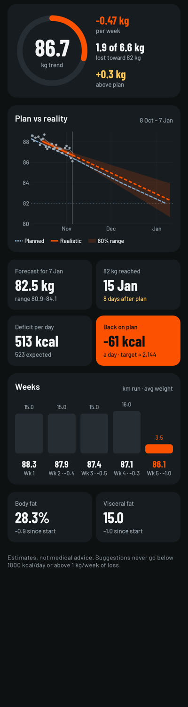
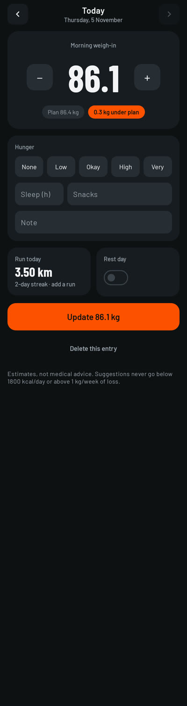
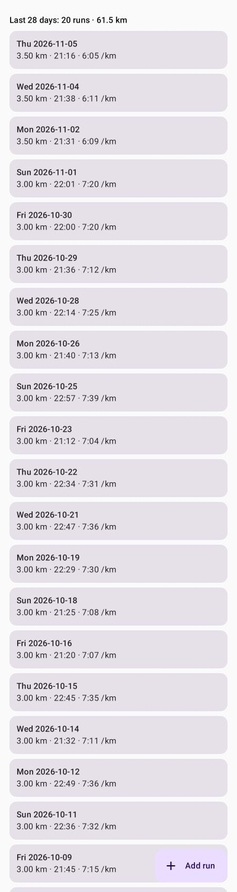
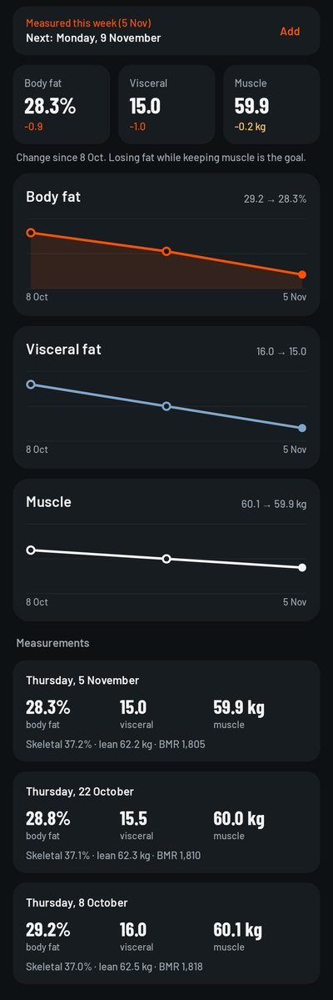
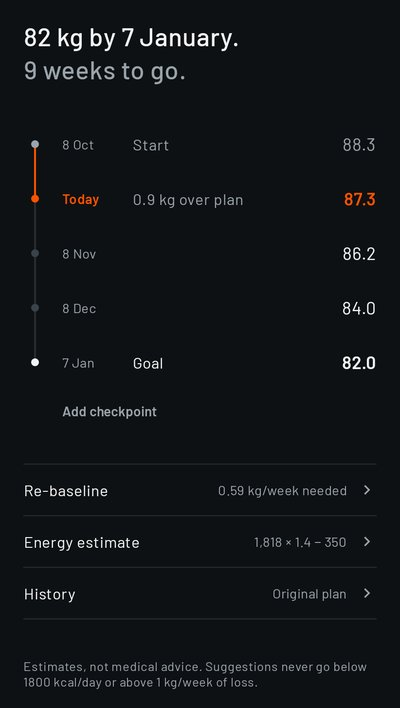

# Wt-tracker

A personal Android app for weight loss. It compares the **planned** trajectory with a **realistic**, data-driven forecast
that updates every time you log a weight. Everything stays on the phone: no accounts, no cloud.

| Dashboard | Today | Runs | Body | Plan |
|---|---|---|---|---|
|  |  |  |  |  |

Screenshots are rendered from sample data by the Robolectric screenshot tests; CI uploads fresh ones as the `screenshots` artifact on every run.

## Features
- **Today:** one running card (today's run, add run, rest-day switch, this week's numbers). On your weekly weigh-in day it shows the weight entry (±0.1 steppers, or from a scale screenshot); other days show when the next weigh-in is, with a shortcut to change the day.
- **Dashboard:**
  - Planned vs realistic chart with an 80 % band.
  - Trend weight and rate, predicted weight on the goal date, ETA for the goal weight, gap vs plan in kg and days.
  - Energy: estimated daily intake now and the intake that gets you back on plan (rounded to 50 kcal, never below 1800), with the deficits in small print. Worked out from the weight trend, so no food logging is needed.
  - Weekly table, body-fat and visceral-fat trends, alerts.
- **Runs:** manual entry, a Strava screenshot, or **Strava `activities.csv` import** (all from Add run). Runs are grouped by Monday–Sunday week; older weeks collapse to one line.
  - Runs, trail runs and virtual runs are imported.
  - Re-importing the same file adds nothing new.
  - Runs you already logged are matched instead of duplicated (same day, about the same distance, or the undated sample runs).
- **Body:** the next weekly measurement (same morning as the weigh-in) with a scale-screenshot import, change tiles, fat, visceral and muscle charts, and the measurements (fat %, visceral, muscle, skeletal %, lean mass, BMR).
- **Plan:**
  - Edit checkpoints.
  - **Re-baseline** from today's trend weight to the same goal date. The weekly loss it would need is flagged as unrealistic above 0.7 kg/week and blocked above 1 kg/week.
  - Energy settings (BMR, activity factor, food deficit).
- **Settings:** weigh-in day and its reminder (Asia/Tokyo time), CSV export, JSON backup/restore.

## How the forecast works (`core/`)
- **Smoothing:** 7-day trailing moving average.
- **Trend:** a Theil–Sen robust line, which ignores water-weight spikes. It uses the last 21 days when they hold 7+ weigh-ins, otherwise the last 42 days when they hold 4+ weigh-ins over at least 3 weeks (weekly weigh-ins). With less it uses all the data and is marked low-confidence.
- **Band:** an 80 % band from the line's standard error, using a MAD-based noise estimate. It widens with the forecast horizon.
- **Energy:**
  - Actual deficit = −slope × 7700 kcal/kg.
  - Expected deficit = planned food deficit + net running kcal.
  - Net running kcal = logged kcal minus the resting burn, or about 0.9 kcal/kg/km when no calories were logged.
- **Safety:** suggestions never go below 1800 kcal/day of intake or above 1 kg/week of loss.

Estimates, not medical advice.

## Modules
- `core/`: pure Kotlin. Holds the forecast, energy balance, alerts, re-baseline, weekly summary, CSV/JSON and Strava parsing.
  Unit-tested on synthetic noisy data.
- `app/`: Android app (Jetpack Compose, Room/SQLite, WorkManager).

## Build
- Core tests (JDK only): `./gradlew :core:test`
- APK (needs an Android SDK): `./gradlew :app:assembleDebug`. GitHub Actions builds it on every push;
  download `wt-tracker-debug-apk` from the run's artifacts and sideload it.
